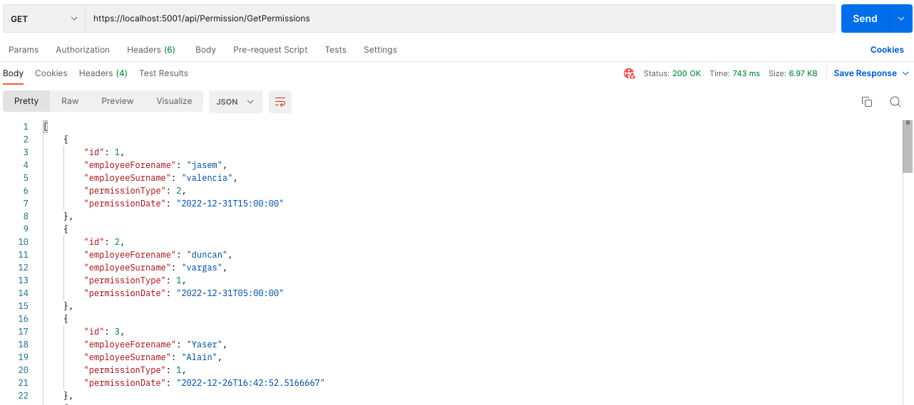
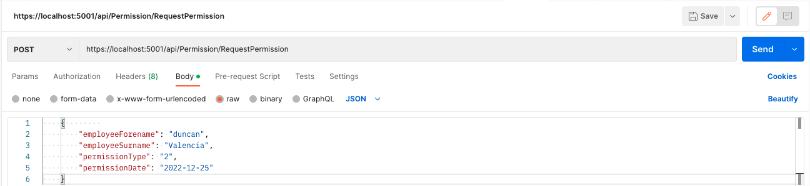
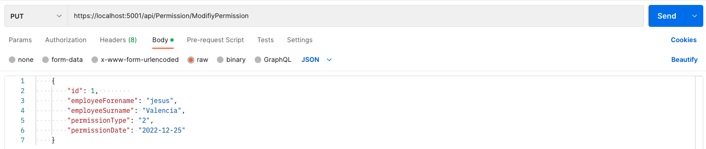

# N5NOW

## 📋 Description

This is a take-home project,and the back end was implemented in .NET CORE.

## ✅  Instructions to Run it on Your Local Machine
​
To have a version on you local machine:
- Clone this repository.
- Open a terminal on the containing folder of this project.
- If you want to run it, run in the proyect.s

## 🎯 Problem Statement

N5 company requests a Web API for registering user permissions.
 - Create a Web API using ASP .NET Core and persist data on SQL Server.
 - Make use of EntityFramework.
 - The Web API must have 3 services “Request Permission”, “Modify
Permission” and “Get Permissions”. 
- Making use of repository pattern and Unit of Work and CQRS
pattern(Desired).

### End point List

### Get permissionss

> https://localhost:5001/api/Permission/GetPermissions

### Request permissionss

> https://localhost:5001/api/Permission/RequestPermission

### Modify permissionss

> https://localhost:5001/api/Permission/ModifiyPermission

## Author

🎨 **Jasem Valencia**

- Github: [@JasemDuncan](https://github.com/JasemDuncan)
- Twitter: [@JasemValencia](https://twitter.com/JasemValencia)
- Linkedin: [@JasemDuncan](www.linkedin.com/in/Jasem-Duncan-Valencia)

## 🤝 Contributing

    Contributions, issues and feature requests are welcome!

Feel free to check the [issues page](https://github.com/JasemDuncan/n5now/issues).

## Show your support

Give a ⭐️ if you like this project!

## 📝 License
This project is [MIT](lic.url) licensed.
This project is for Educational purposes.