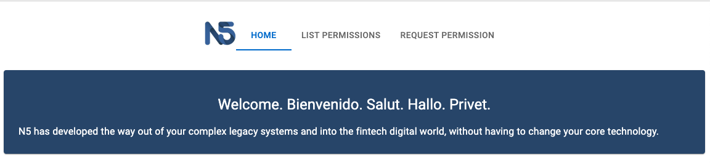
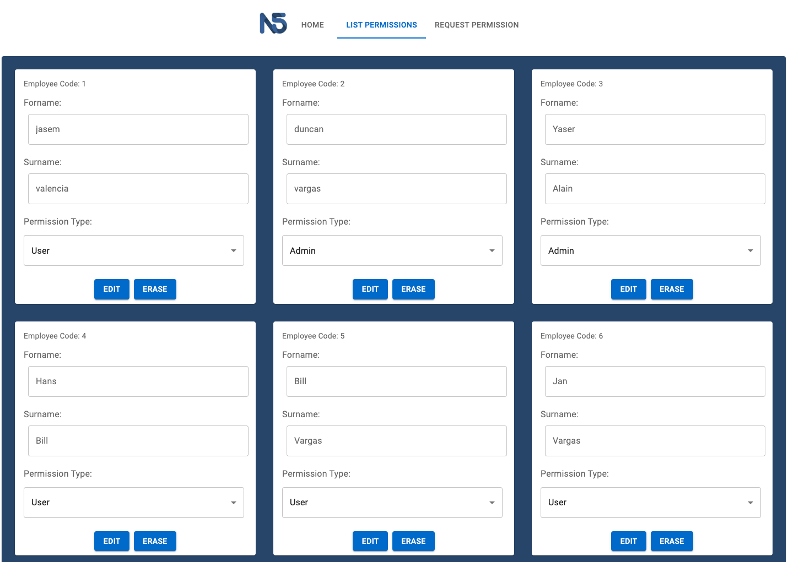
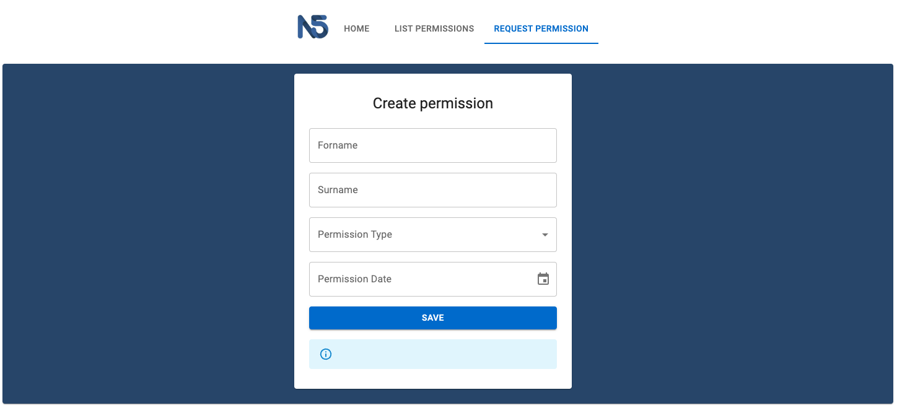
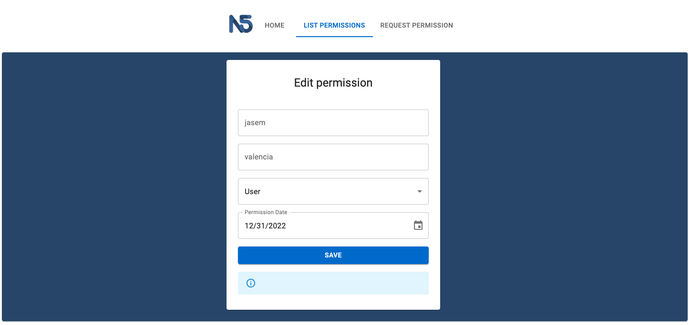

# Torc_THP_Receipt

## 📋 Description

This is a take-home project,and the front end it is implemented in React.

## ✅  Instructions to Run it on Your Local Machine
​
To have a version on you local machine:
- Clone this repository.
- Open a terminal on the containing folder of this project.
- If you want to run it, run in the console:
> npm start

## 🎯 Problem Statement

N5 company requests a Web API for registering user permissions.
 - Build an app in ReactJS and use Axios to connect to the backend.
 - Create the forms to consume the Web API.
 - For the visual components, the candidate must use those provided by
the Material-UI library.

### Main

### List permissionss

### Request permission

### Modify permission

## Author

🎨 **Jasem Valencia**

- Github: [@JasemDuncan](https://github.com/JasemDuncan)
- Twitter: [@JasemValencia](https://twitter.com/JasemValencia)
- Linkedin: [@JasemDuncan](www.linkedin.com/in/Jasem-Duncan-Valencia)

## 🤝 Contributing

    Contributions, issues and feature requests are welcome!

Feel free to check the [issues page](https://github.com/JasemDuncan/n5now/issues).

## Show your support

Give a ⭐️ if you like this project!

## 📝 License
This project is [MIT](lic.url) licensed.
This project is for Educational purposes.